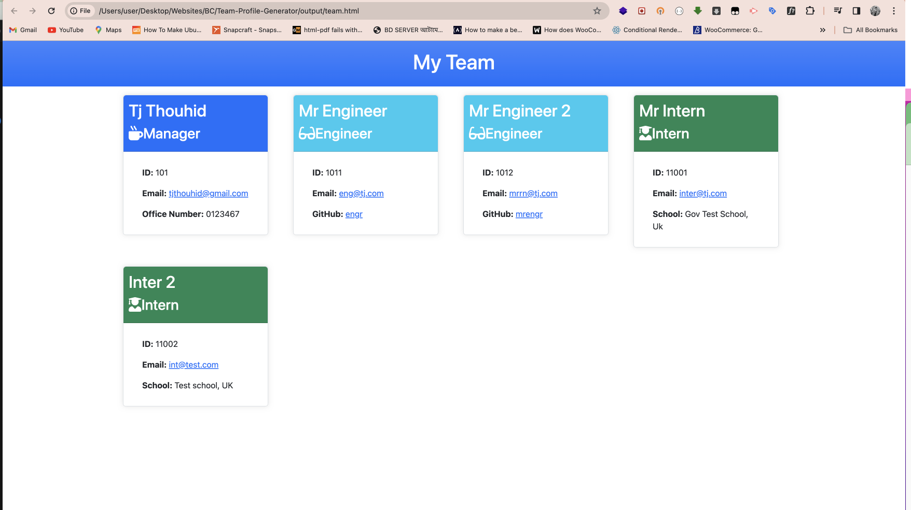
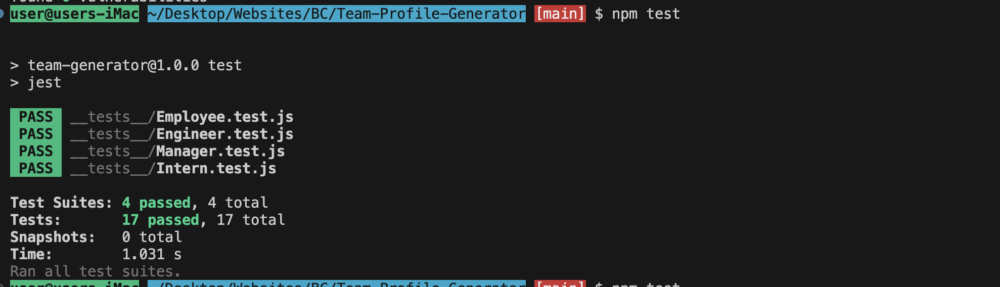

# Team Profile Generator

A command-line application to generate a webpage displaying a software engineering team's basic information.

## Table of Contents

- [Introduction](#introduction)
- [Features](#features)
- [Technologies Used](#technologies-used)
- [Getting Started](#getting-started)
- [Usage](#usage)
- [Screenshots](#screenshots)
- [Deployment](#deployment)
- [Contributing](#contributing)
- [About Me](#about-me)
- [License](#license)

## Introduction

The Team Profile Generator is a command-line application designed to help managers generate a webpage displaying basic information about their software engineering team members. It prompts the user to input information about each team member, including their name, ID, email, and role. Additionally, it collects specific information based on the role, such as office number for managers, GitHub username for engineers, and school for interns. The application then generates an HTML file that displays summaries for each team member, making it easy for managers to access their team's emails and GitHub profiles.

## Features

- Add team members with their respective roles: manager, engineer, and intern.
- Collect specific information based on the role of each team member.
- Generate an HTML webpage displaying summaries for each team member.
- Responsive design for various screen sizes.

## Technologies Used

- Node.js
- Inquirer.js
- Jest (for testing)

## Getting Started

To get started with the Team Profile Generator, follow these steps:

1. Clone this repository to your local machine.

```bash
git clone https://github.com/your-username/team-profile-generator.git
```

2. Navigate to the project directory in your terminal.
```dash
cd team-profile-generator
```
3. Install dependencies.
```dash
npm install
```
4. Test The Application 
```dash
npm test
```
4. Run the application.
```dash
node index.js
```
or
```dash
npm start
```

## Usage

1. Run the application using npm start.
2. Follow the prompts to input information about each team member.
3. Choose to add another team member or finish building the team.
4. Once finished, the application generates an HTML file in the output directory.

## Screenshots




## Deployment

The team page can be viewd on `output/team.html`.

## Contributing

If you would like to contribute to this project, please follow these steps:

1. Fork the repository.
2. Create a new branch for your feature or improvement.
3. Make changes and submit a pull request.

## 🚀 About Me

I'm a full stack developer...

## 🔗 My Links

[](https://github.com/tjthouhid//)
[](https://www.linkedin.com/in/tjthouhid)
[](https://twitter.com/tjthouhid)

## License

This project is licensed under the [MIT License](LICENSE).
